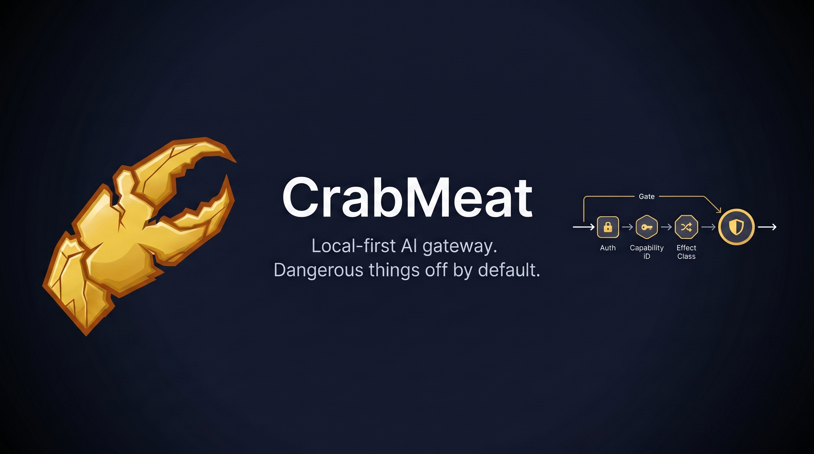
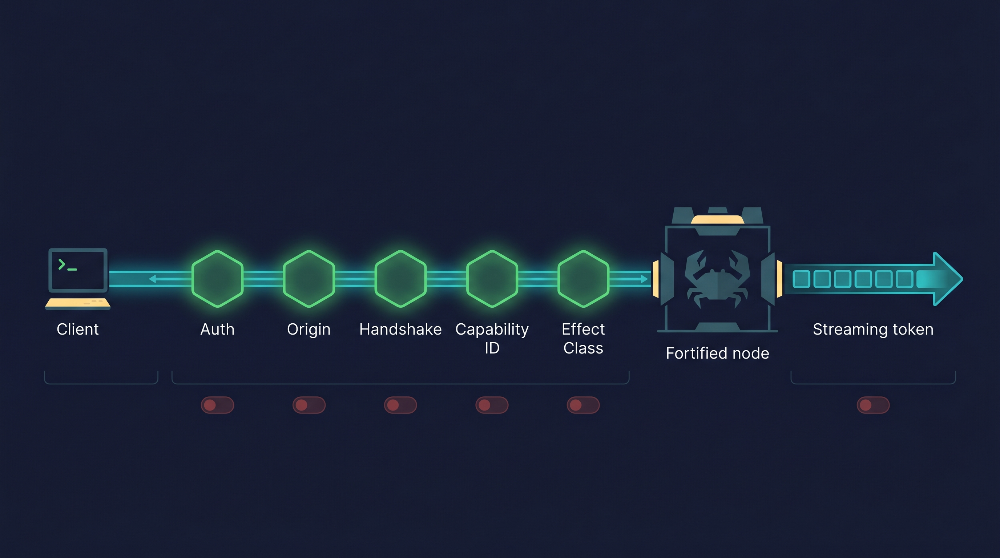
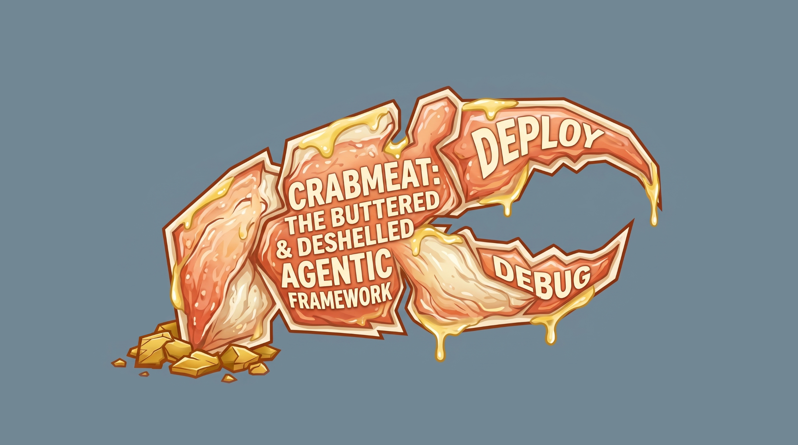

# CrabMeat

> An original, security-first agentic framework. Dangerous things off by default; the LLM never holds the security boundary.

<p align="center">
  

CrabMeat is an original, security-first agentic framework: a minimal WebSocket
gateway that routes client messages to AI providers (OpenAI, Anthropic, and any
OpenAI-compatible endpoint like Ollama or LM Studio) with a small set of built-in
tools and a clear path for the community to add more.

We studied the prior art in the agentic-gateway space and built something
different. **This repo is the bare-bones core loop:**

```
Client connects (WebSocket)
  -> Auth -> Origin check -> Protocol handshake
  -> Route to agent + session
  -> Build context (system prompt + history + tools)
  -> Stream from AI provider
  -> Persist transcript
```

Everything else is feature work on top of that loop.

---

## Status

**Early release.** The core loop, security rails, and a handful of tools are working and
covered by tests. The external **Arbiter intent gate** sits ahead of the persona-bearing
context window. Layer 2 (local-model disambiguation) is opt-in. Multi-evaluator consensus,
skills, scheduler, and a few other subsystems exist in the internal tree and will land
in this repo incrementally as each one is hardened. See [ROADMAP.md](ROADMAP.md).

If you want a tool added, **open an issue**; see [CONTRIBUTING.md](CONTRIBUTING.md).

### Stability tiers

Not every feature is at the same maturity. The four tiers below describe what
each surface is rated for in v0.1.0. The shorthand label appears next to
features in the rest of the README and in `ROADMAP.md`.

- **stable** — exercised by the full test suite, threat-modeled, ready for
  daily use. The core loop, the WebSocket gateway, the built-in tools table
  below, the email connector, the audit chain, the secret-leak filter, the
  workspace jail, and every always-on protection are all stable for v0.1.0.
- **beta** — feature-complete and shipped, but the surface is younger and
  may grow rough edges under unusual load. Includes: `layer2` local-model
  routing, `refusalFallback` content-class reroute, `scheduler` cron + webhook
  triggers, `webhooks` inbound receiver, `skills` drop-in packs, `hooks`
  lifecycle handlers, and `cortexDream` memory consolidation. Operate behind
  the same loopback / TLS / auth defaults as the stable surface.
- **experimental** — opt-in, behavior may change between minor versions, no
  long-term API guarantees. Includes: `plan_mode` DAG validation (executor
  not landed), the OTEL diagnostics boundary (signal set still settling).
- **not-recommended-for-network-exposed** — works, but the threat model
  assumes loopback or TLS-fronted deployment and lowering that bar voids
  the security posture. Includes: gateway with `auth.mode='none'`, any non-
  loopback `gateway.host` without `gateway.tls`, `webhooks.requireSecret=false`.
  `crabmeat doctor --strict` refuses to validate any of these.

The default `crabmeat.example.json` ships with stable + a few beta features
on. Anything experimental requires explicit opt-in.

---

## Why another gateway?

The AI agent ecosystem has a pattern: ship features fast, document security later, hope
operators read the docs. The result:

- Tens of thousands of agentic AI gateways sitting on the public internet,
  documented by security scans in early 2026
- Default configs that accept unauthenticated connections
- Community skill registries where anyone can publish executable code
- Context handoff plugins that ship your entire session to third-party APIs on rate limit

CrabMeat takes the opposite approach: **dangerous things are off by default, safe things are
always on, and the LLM never controls the security boundary.**

---

## What's in this repo

<p align="center">
  

### The core loop
- WebSocket gateway with origin check, frame size caps, and timing-safe auth
- Session management with JSON-backed transcripts and context compaction
- Multi-provider inference (OpenAI, Anthropic, OpenAI-compatible)
- Streaming token output with mid-stream secret scanning
- Tool execution with effect classification and per-session capability ID indirection

### Built-in tools (confirmed working)

| Tool | Effect | What it does |
|---|---|---|
| `file_read` | read | Read a file inside the workspace jail |
| `file_write` | write | Write/append a file inside the workspace jail |
| `file_move` | write | Move/rename a file inside the workspace jail |
| `file_copy` | write | Copy a file inside the workspace jail |
| `file_list` | read | List directory contents |
| `glob_search` | read | Glob-pattern file search |
| `shell` | exec | Run a shell command (denylist-filtered, cwd scoped to configured roots, output capped) |
| `web_fetch` | network | HTTP GET with SSRF protection (blocks metadata, link-local, RFC1918) |
| `memory_write` | write | Persist a note to the agent's memory store |
| `memory_read` | read | Read from the agent's memory store |
| `email_attach` | read | Attach an existing allowed file to the next email reply |
| `email_attach_content` | write | Create a file and attach it to the next email reply |
| `timer` | none | Pure delay primitive |
| `random` | none | Seeded random values |

Every tool is validated against the agent's `allowedEffects` before execution, and every
tool call is written to a tamper-evident SHA-256 hash-chained audit log.

---

<p align="center">
  

## Security (always-on, cannot be disabled)

These protections are enforced in code. There is no config flag to turn them off.

| Protection | What it stops |
|---|---|
| **Capability ID indirection** | LLM guessing/forging tool names (tools exposed via per-session HMAC IDs) |
| **Effect class enforcement** | Unauthorized tool execution |
| **IRONCLAD_CONTEXT** | Prompt injection overriding agent behavior |
| **Output leak detection** | Secrets in LLM responses (streaming regex across token boundaries) |
| **Canary tokens** | System prompt exfiltration |
| **Tool result trust wrapping** | Second-order prompt injection via tool output |
| **Workspace jail** | Path traversal in file tools |
| **Shell denylist** | Catastrophic commands (`rm -rf /`, `curl \| bash`, `format C:`) |
| **SSRF protection** | Cloud metadata, link-local, RFC1918 ranges |
| **Timing-safe auth** | Credential brute-forcing via timing side-channels |
| **Tamper-evident audit log** | Undetected tool call history manipulation |
| **Frame size limits** | Memory exhaustion via oversized WebSocket frames |
| **HTTP security headers** | Clickjacking, MIME-sniffing, content injection |
| **Input normalization** | Obfuscated prompt injection (Base64, ROT13, homoglyphs, invisible Unicode) |
| **Secret reference resolution** | Secrets appearing in LLM context (`$SECRET:NAME` resolved at exec time) |

### On by default, configurable

| Protection | Default | Config key |
|---|---|---|
| Audit logging | Enabled | `audit.enabled` |
| Sigil trust validation | Required | `gateway.sigil.required` |
| Auth mode | Token (32+ chars) | `gateway.auth.mode` |

### Opt-in (disabled by default)

Anything that expands attack surface is off until an operator explicitly turns it on.
See the full list in `crabmeat.example.json`.

---

## Quick Start

```bash
# 1. Install dependencies
npm install

# 2. Configure secrets: copy .env.example, then edit .env to set
#    CRABMEAT_TOKEN (32+ chars) and your provider API key.
cp .env.example .env
node -e "console.log(require('crypto').randomBytes(32).toString('hex'))"
# paste the output into CRABMEAT_TOKEN in .env; add ANTHROPIC_API_KEY (or
# OPENAI_API_KEY) on the matching line.

# 3. Configure the gateway: copy the example and edit the providers block
#    to match the key you set in step 2. The default ships an Anthropic
#    provider stub; swap in OpenAI or a local Ollama endpoint if you prefer.
cp crabmeat.example.json crabmeat.json

# 4. Build
npm run build

# 5. Launch
#    Windows:  double-click start.bat (or run it from cmd.exe)
#    *nix:     see "Launching on Linux / WSL" below
```

Connect via WebSocket to `ws://127.0.0.1:3000` and authenticate with the token from step 2.

### Launching on Linux / WSL

No `start.bat` on *nix. Open two terminals:

```bash
# Terminal 1 — gateway
set -a; . ./.env; set +a
node dist/entry.js run

# Terminal 2 — chat CLI
node dist/entry.js chat --token "$CRABMEAT_TOKEN"
```

If you're using a local provider, start it before terminal 1 (e.g. `ollama serve` in a third terminal, or as a system service).

### Email Agent

CrabMeat can run as a bidirectional email agent: an allowlisted sender emails the
agent mailbox, CrabMeat polls IMAP, runs the request locally, and replies by SMTP
with markdown-rendered HTML, threading headers, reply-all support, and attachments.

Put mailbox credentials in `.crabmeat/local.json`:

```json
{
  "connectors": {
    "emailImap": {
      "user": "agent-mailbox@gmail.com",
      "password": "gmail-app-password",
      "allowFromAddresses": ["you@example.com"],
      "outboundTo": ["you@example.com"]
    }
  }
}
```

Notes:

- `allowFromAddresses` is required. There is no open inbox mode.
- Gmail requires an App Password; normal passwords and passkeys do not work for IMAP.
- Replies preserve threads via `In-Reply-To` / `References`.
- Long responses are shortened inline and attached as markdown.
- The agent can attach files with `email_attach` or create-and-attach with `email_attach_content`.
- `message_send` can target the email connector id, usually `email-imap`, for proactive status updates.

### File Access

By default, file tools are jailed to the workspace. To let the email agent work on
normal user files without a global YOLO mode, grant scoped roots:

```json
{
  "fileAccessPresets": ["downloads", "documents", "desktop"],
  "fileAccessPaths": ["D:/Media/Inbox"]
}
```

`fileAccessPresets` expands to common subfolders under the current user's home.
`fileAccessPaths` must contain explicit absolute subdirectories; drive roots,
home itself, UNC share roots, relative paths, and traversal segments are rejected.
The `shell` tool also accepts an optional `cwd`, but only inside the workspace or
these configured roots.

### Slash commands

| Command | Description |
|---|---|
| `/help` | List all commands |
| `/status` | System status |
| `/compact` | Force context compaction on current session |
| `/doctor` | Run diagnostics |
| `/sessions` | List active sessions |
| `/kill` | Trip the circuit breaker |
| `/reset` | Reset the circuit breaker |

---

## Development

```bash
npm run typecheck
npm test
npm run build
```

---

## Contributing

Bug reports, security reports, and tool requests are all welcome.

- **Found a bug or security issue?** Open an issue. For anything sensitive, please mark
  it as a security report in the issue template.
- **Want a tool added?** See [CONTRIBUTING.md](CONTRIBUTING.md) for the request template
  and the effect-class rules.
- **Want to know what's planned?** See [ROADMAP.md](ROADMAP.md).

---

## License

[Apache 2.0](./LICENSE). Copyright © 2026 Nathan Seals.

**CrabMeat™** and the CrabMeat butter-claw logo are trademarks of Nathan Seals.
They are *not* covered by the Apache 2.0 license. Forks are welcome; please use
a different name and logo for derivative projects. See
[TRADEMARK.md](../TRADEMARK.md).

## Support Me
If you find this useful, consider supporting me and my research:

[](https://ko-fi.com/mr_gl00m)
[](https://ko-fi.com/mr_gl00m)

**Crypto:**
- BTC: `bc1qnedeq3dr2dmlwgmw2mr5mtpxh45uhl395prr0d`
- ETH: `0x1bCbBa9854dA4Fc1Cb95997D5f42006055282e3c`
- SOL: `3Wm8wS93UpG2CrZsMWHSspJh7M5gQ6NXBbgLHDFXmAdQ`

---

<p align="center">
  

---
